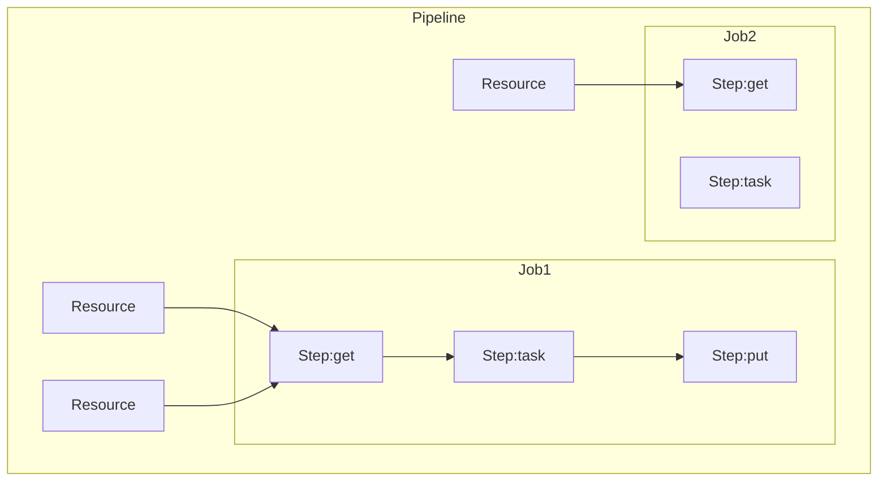



Concourse はオープンソースなCI/CDツールで、コンテナベースで稼働する。
Pivotalのエンジニアが開発しており、1.0.0がリリースされたのが2016年と比較的新しいツールで、[[Go]] で開発されている。

[パイプラインベースのCI/CDツール、Concourseとは？ | Think IT（シンクイット）](https://thinkit.co.jp/article/11556)

[GitHubリポジトリ](https://github.com/concourse/concourse) を見るとstarは7.1k([[2024-01-31]]時点)あり、コミットも活発に行われている様子

[[Jenkins]] の代替を探している中で見つけた。
コンテナで簡単に動かせるというのが嬉しい。

## Tutorial

https://concourse-ci.org/quick-start.html

[日本語チュートリアル](https://concoursetutorial-ja.site.lkj.io/)もあるので、こちらも適宜参考にしつつ進める

### Docker Compose でサーバーを起動する

```shell
$ curl -O https://concourse-ci.org/docker-compose.yml
```

バージョンを指定しておく
 
```diff title:compose.yaml
version: '3'

services:
  concourse-db:
-   image: postgres
+   image: postgres:14-alpine
    environment:
      POSTGRES_DB: concourse
      POSTGRES_PASSWORD: concourse_pass
      POSTGRES_USER: concourse_user
      PGDATA: /database

  concourse:
-   image: concourse/concourse
+   image: concourse/concourse:7.11
    command: quickstart
    privileged: true
    depends_on: [concourse-db]
    ports: ["8080:8080"]
    environment:
      CONCOURSE_POSTGRES_HOST: concourse-db
      CONCOURSE_POSTGRES_USER: concourse_user
      CONCOURSE_POSTGRES_PASSWORD: concourse_pass
      CONCOURSE_POSTGRES_DATABASE: concourse
      CONCOURSE_EXTERNAL_URL: http://localhost:8080
      CONCOURSE_ADD_LOCAL_USER: test:test
      CONCOURSE_MAIN_TEAM_LOCAL_USER: test
      # instead of relying on the default "detect"
      CONCOURSE_WORKER_BAGGAGECLAIM_DRIVER: overlay
      CONCOURSE_CLIENT_SECRET: Y29uY291cnNlLXdlYgo=
      CONCOURSE_TSA_CLIENT_SECRET: Y29uY291cnNlLXdvcmtlcgo=
      CONCOURSE_X_FRAME_OPTIONS: allow
      CONCOURSE_CONTENT_SECURITY_POLICY: "*"
      CONCOURSE_CLUSTER_NAME: tutorial
      CONCOURSE_WORKER_CONTAINERD_DNS_SERVER: "8.8.8.8"
      # For ARM-based machine, change the Concourse runtime to "houdini"
      CONCOURSE_WORKER_RUNTIME: "containerd"
```

```shell
$ docker compose up -d
```

### M1で動かない

[Worker fails to start on Docker for Mac with M1 · Issue #8270 · concourse/concourse](https://github.com/concourse/concourse/issues/8270)

いきなり壁にぶつかる。compose.yamlに注意書きされている通り、ARMマシン上では `CONCOURSE_WORKER_RUNTIME: "houdini"` に変える必要がある。

```diff title:compose.yaml
      # For ARM-based machine, change the Concourse runtime to "houdini"
-     CONCOURSE_WORKER_RUNTIME: "containerd"
+     CONCOURSE_WORKER_RUNTIME: "houdini"
```

### 起動した

起動すると localhost:8080 でこんな画面が見れるようになる。

![[note/Pasted-image-20240131031815.png|]]
### Fly cliを入れる

Concourse用のCLI。

```shell
$ curl 'http://localhost:8080/api/v1/cli?arch=amd64&platform=darwin' -o fly
$ chmod +x fly
$ ./fly -t tutorial login -c http://localhost:8080 -u test -p test

## ログイン情報はHOMEに作られる
$ cat ~/.flyrc
targets:
  tutorial:
    api: http://localhost:8080
    team: main
    token:
      type: bearer
      value: XXXXXXXX
```

### Pipelineを作ってみる

Concourseには pipeline, job, step, resource というコンポーネントがある。
関係性は以下のようになっていて、pipelineの中に複数のjobやresourceがあり、jobは複数のstepで構成される。



実行するイメージやコマンドを書く

```yaml title:hello-world.yaml
jobs:
- name: hello-world-job
  plan:
  - task: hello-world-task
    config:
      # Tells Concourse which type of worker this task should run on
      platform: linux
      # This is one way of telling Concourse which container image to use for a
      # task. We'll explain this more when talking about resources
      image_resource:
        type: registry-image
        source:
          repository: busybox # images are pulled from docker hub by default
      # The command Concourse will run inside the container
      # echo "Hello world!"
      run:
        path: echo
        args: ["Hello world!"]
```

```shell
# パイプラインをアップロード
$ ./fly -t tutorial set-pipeline -p hello-world -c hello-world.yml
# パイプラインを適用
$ ./fly -t tutorial unpause-pipeline -p hello-world
# ジョブを実行
$ ./fly -t tutorial trigger-job --job hello-world/hello-world-job --watch
```

### M1で動かない

ジョブが `find or create container on worker 06630b9c1782: stream image metadata file: failed to stream out from volume` といったエラーでコケる。。

["Quickstart" Guide doesn't work on M1 Mac due to docker compose issue · Issue #8719 · concourse/concourse](https://github.com/concourse/concourse/issues/8719)

こちらにある通り、imageを有志が作ったarm対応の `rdclda/concourse:7.9.1` に変更して、 `CONCOURSE_WORKER_RUNTIME: "containerd"` に戻したところ正常実行されるようになった。


> [!WARNING]
> あくまで非公式なのでarmで動かしたい場合は公式の対応を待ったほうが良さげ。

## Dockerイメージをビルドするパイプライン


```yaml title:docker-build.yaml
resources:
# The repo with our Dockerfile
- name: concourse-examples
  type: git
  icon: github
  source:
    uri: https://github.com/concourse/examples.git
    branch: master

jobs:
- name: build-and-push
  plan:
  - get: concourse-examples
  - task: build-task-image
    privileged: true
    config:
      platform: linux
      image_resource:
        type: registry-image
        source:
          repository: concourse/oci-build-task
      inputs:
      - name: concourse-examples
      outputs:
      - name: image
      params:
        CONTEXT: concourse-examples/Dockerfiles/simple
      run:
        path: build
```

```shell
./fly -t tutorial set-pipeline -p docker-build -c docker-build.yaml
./fly -t tutorial unpause-pipeline -p docker-build
./fly -t tutorial trigger-job --watch --job docker-build/build-and-push
```

=> oci-build-task で失敗した。。Macだからなのか、このタスクのイメージ自体あまり更新されていなくて古いからなのかちょっと調べただけではわからなかった

```
#5 [1/4] FROM docker.io/library/busybox@sha256:6d9ac9237a84afe1516540f40a0fafdc86859b2141954b4d643af7066d598b74
#5 resolve docker.io/library/busybox@sha256:6d9ac9237a84afe1516540f40a0fafdc86859b2141954b4d643af7066d598b74 0.0s done
#5 sha256:9ad63333ebc97e32b987ae66aa3cff81300e4c2e6d2f2395cef8a3ae18b249fe 0B / 2.22MB 0.2s
#5 sha256:9ad63333ebc97e32b987ae66aa3cff81300e4c2e6d2f2395cef8a3ae18b249fe 2.22MB / 2.22MB 0.3s done
#5 extracting sha256:9ad63333ebc97e32b987ae66aa3cff81300e4c2e6d2f2395cef8a3ae18b249fe
#5 extracting sha256:9ad63333ebc97e32b987ae66aa3cff81300e4c2e6d2f2395cef8a3ae18b249fe 0.3s done
#5 DONE 0.7s

#6 [2/4] RUN echo "I'm simple!"
#6 0.229 Error while loading init: No such file or directory
#6 0.263 runc run failed: unable to start container process: can't copy bootstrap data to pipe: write init-p: broken pipe
#6 ERROR: process "/bin/sh -c echo \"I'm simple!\"" did not complete successfully: exit code: 1
------
 > [2/4] RUN echo "I'm simple!":
#6 0.229 Error while loading init: No such file or directory
#6 0.263 runc run failed: unable to start container process: can't copy bootstrap data to pipe: write init-p: broken pipe
------
Dockerfile:3
--------------------
   1 |     FROM busybox
   2 |
   3 | >>> RUN echo "I'm simple!"
   4 |     COPY ./stranger /stranger
   5 |     RUN cat /stranger
--------------------
```

そこでBuildkitではなく [[note/Kaniko|Kaniko]] を使ってみることにした。
https://github.com/concourse/oci-build-task/issues/46

```yaml
resources:
# The repo with our Dockerfile
- name: concourse-examples
  type: git
  icon: github
  source:
    uri: https://github.com/concourse/examples.git
    branch: master

jobs:
- name: build-and-push
  plan:
  - get: concourse-examples
  - task: build-task-image
    config:
      platform: linux
      image_resource:
        type: registry-image
        source:
          repository: gcr.io/kaniko-project/executor
          tag: debug

      inputs:
      - name: concourse-examples
      outputs:
      - name: image
      params:
        CONTEXT: concourse-examples/Dockerfiles/simple
        BRANCH: dev
        PUSH:
        TAG_SUFFIX:

      run:
        path: sh
        args:
          - -ecx
          - |
            CREDENTIALS_FILE=credentials/config.json
            test -f $CREDENTIALS_FILE && cp $CREDENTIALS_FILE /kaniko/.docker/config.json || echo "Missing credentials file!"
            FILE_SHORT_REF=concourse-examples/.git/short_ref
            git_short_ref=$(test -f $FILE_SHORT_REF && cat $FILE_SHORT_REF || echo "dev")
            FILE_REF=concourse-examples/.git/ref
            git_ref=$(test -f $FILE_REF && cat $FILE_REF || echo "dev")
            destination_flag=$(test -z $PUSH && echo "--no-push" || \
                echo "--destination $REPOSITORY:$git_short_ref$TAG_SUFFIX --destination $REPOSITORY:latest$TAG_SUFFIX")
            /kaniko/executor --force \
                --build-arg "version=$git_ref" \
                --single-snapshot \
                --label org.opencontainers.image.version=$BRANCH \
                --label org.opencontainers.image.revision=$git_ref \
                --label org.opencontainers.image.created=$(date -Iseconds -u) \
                --context $CONTEXT/ \
                --skip-unused-stages \
                $destination_flag

```

=> これであればビルドは通った。記述量多すぎてメリットが薄れるかも…
## Kubernetes上にデプロイする

[Helm chart](https://github.com/concourse/concourse-chart) がある！


## 参考

- [EKS上にConcourse CIをデプロイする - APC 技術ブログ](https://techblog.ap-com.co.jp/entry/2018/12/26/083000)
