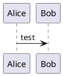

-   [plantuml/plantuml: Generate UML diagram from textual description](https://github.com/plantuml/plantuml)
-   [シンプルなテキストファイルで UML が書ける、オープンソースのツール](https://plantuml.com/)
-   テキストファイルで UML 図を記述できる
-   本体は Java で書かれていて、単一の jar ファイルを落としてきてコマンドラインから実行できる
-   Visual Studio CodeやIntellijなどにプラグインがある
-   ライセンスは GPL v3
    -   [plantuml/license.txt at master · plantuml/plantuml](https://github.com/plantuml/plantuml/blob/master/license.txt)

以下のような図が書ける

-   [シーケンス図](https://plantuml.com/ja/sequence-diagram)
-   [ユースケース図](https://plantuml.com/ja/use-case-diagram)
-   [クラス図](https://plantuml.com/ja/class-diagram)
-   [オブジェクト図](https://plantuml.com/ja/object-diagram)
-   [アクティビティ図](https://plantuml.com/ja/activity-diagram-beta)（[古い文法はこちら](https://plantuml.com/ja/activity-diagram-legacy)）
-   [コンポーネント図](https://plantuml.com/ja/component-diagram)
-   [配置図](https://plantuml.com/ja/deployment-diagram)
-   [状態遷移図（ステートマシン図）](https://plantuml.com/ja/state-diagram)
-   [タイミング図](https://plantuml.com/ja/timing-diagram)

[オンラインサーバー](http://www.plantuml.com/plantuml)で簡単に試すことが可能

## インストール

<https://plantuml.com/ja/faq-install>

<https://plantuml.com/ja/starting>

必要なもの

-   Java
-   [Graphviz](https://plantuml.com/ja/graphviz-dot)
    -   シーケンス図とアクティビティ図以外を作る場合には必須
-   [PlantUML本体](http://sourceforge.net/projects/plantuml/files/plantuml.jar/download)

Macであればbrewで

```shell
brew install graphviz plantuml
```

## 使い方

`sequence.puml` というファイルを作成



ターミナルで実行

```shell
plantuml sequenceDiagram.txt
```

`sequenceDiagram.png` ができる
