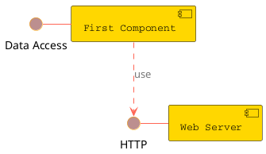

#PlantUML

[[PlantUML]] の skinparam で図の見た目を変更できる

<https://plantuml.com/ja/skinparam>

```puml
@startuml
skinparam interface {
  backgroundColor RosyBrown
  borderColor orange
}

skinparam component {
  FontSize 13
  BackgroundColor<<Apache>> Red
  BorderColor<<Apache>> #FF6655
  FontName Courier
  BorderColor black
  BackgroundColor gold
  ArrowFontName Impact
  ArrowColor #FF6655
  ArrowFontColor #777777
}

() "Data Access" as DA

DA - [First Component]
[First Component] ..> () HTTP : use
HTTP - [Web Server] << Apache >>
@enduml
```
