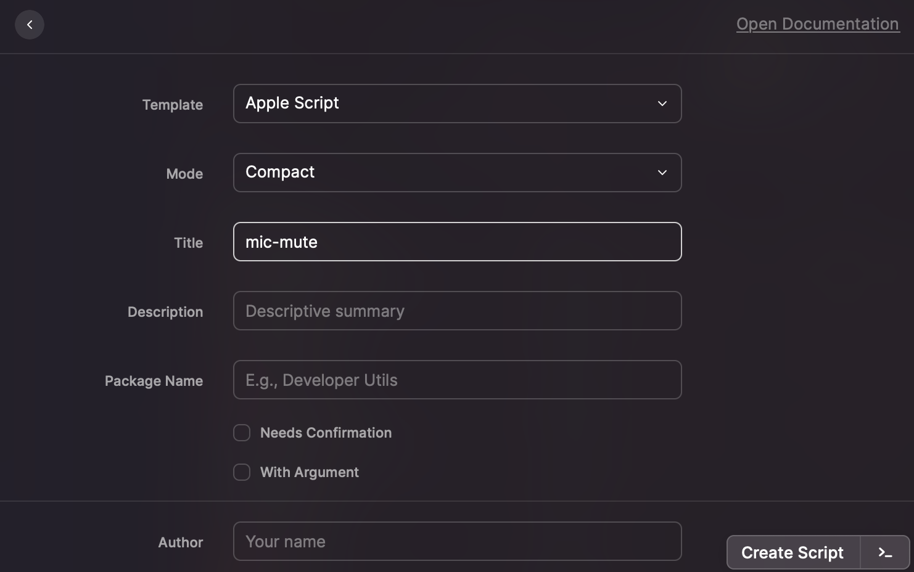

[Raycast](Raycast.md) を使ってマイクのミュートを切り替えます

Raycastの設定 > Extensions > +ボタン > Create Script Command > templateをApple Scriptにして任意の場所に作成



````applescript:mute.applescript
#!/usr/bin/osascript

# Required parameters:
# @raycast.schemaVersion 1
# @raycast.title mic mute
# @raycast.mode compact

# Optional parameters:
# @raycast.icon 🤖

set micVolume to muteMic()
display notification micVolume with title "Mic"
return micVolume

on muteMic()
	set inputVolume to 0
	set micVal to "🔇 muted"
	set volume input volume inputVolume
	return micVal
end muteMic
````

同様にして、 `unmute.applescript` を作成

````applescript:mute.applescript
#!/usr/bin/osascript

# Required parameters:
# @raycast.schemaVersion 1
# @raycast.title mic unmute
# @raycast.mode compact

# Optional parameters:
# @raycast.icon 🤖

set micVolume to unmuteMic()
display notification micVolume with title "Mic"
return micVolume

on unmuteMic()
	set inputVolume to 80
	set micVal to "🔈 unmuted"
	set volume input volume inputVolume
	return micVal
end unmuteMic
````

Raycastの設定 > Extensions から、コマンドにショートカットを設定することができます。
私はアンミュートを `Cmd + Opt + m` , ミュートを `Cmd + Shift + Opt + m` に設定しています。

トグルのほうがいい場合は [マイクのミュート・アンミュートを切り替える](%E3%83%9E%E3%82%A4%E3%82%AF%E3%81%AE%E3%83%9F%E3%83%A5%E3%83%BC%E3%83%88%E3%83%BB%E3%82%A2%E3%83%B3%E3%83%9F%E3%83%A5%E3%83%BC%E3%83%88%E3%82%92%E5%88%87%E3%82%8A%E6%9B%BF%E3%81%88%E3%82%8B.md) のスクリプトを作成する。
自分は現在の状態がミュートアンミュートのどちらであっても同じ動作をさせたいためそれぞれのコマンドを登録しています。
