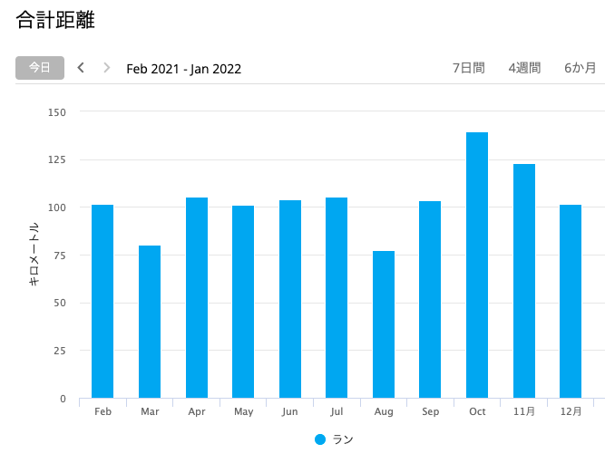

## 2021年にやったこと

### Kotlin + Spring Boot

1月〜3月ごろはKotlin + Spring Boot を触っていました。
Kotlinで初めてサーバーサイドを1から作れていい経験になりました。
Spring BootはWebサーバーつくるにあたってほしい機能が一通り揃っていて助かりました。
Springもほぼ初めてで悩むことはありましたが、Kotlinだから詰まったということはなかったように思います。

MockKできっちりテスト書きながら進められたのもよかったです。
SpringがとにかくDI周りのことを何も考えなくてもやってくれるので、
とくにハマることもなくinjectionしてmockしたらテストがかけてストレスが少なかったです。

この時期は技術的には楽しいことをやれていましたが、負荷も高くて疲れてもいました。

### Go + Lambda

AWS Lambdaでバッチを書いたりAPIサーバー作ったりと、何かと触る機会が多かったです。
何回か書いていくうちにテストのしやすさやメンテしやすさを考慮した設計ができるようになったと思います。

リリースされたばかりの[aws-sdk-go-v2](https://github.com/aws/aws-sdk-go-v2)も使いながら、知見を貯めることができました。

### 競プロ

計算量とかアルゴリズムをちゃんと意識できるようにならなきゃいかんと思って、
2月〜3月ごろは競プロにハマってC++を勉強したり
[問題解決力を鍛える！アルゴリズムとデータ構造](https://www.amazon.co.jp/dp/B08PV83L3N) を読んだりしていました。

AtCoder茶色になったくらいで離れてしまいましたが、また再開したいと思っています。

業務上はそんなに活かせてないですが、データ量が大きいときにループしているコードを見て「これ1秒以上かかるけど大丈夫？」のような勘が働くようになったのは良かったと思います。

### Obsidian

[Obsidian](https://obsidian.md/) でメモを取るようになりました。
markdownで全て管理できるのが気に入ってます。
あまり使いこなせてる気はしませんが、markdownなので特定のツールにロックインされることがないのが嬉しいです。

Google KeepメモやEvernoteにためていたノート類もエクスポートして、markdown管理にしています。
一発でmarkdownにすることができなかったので、一度Notionにインポートしてからmarkdownでエクスポートしました。

作業記録やタスクもObsidian上で管理するようになりました。
いままでもTogglやTodoistは使っていましたが、ぜんぜん続かず思い出したときにだけ書くからあまり意味がなかったのですが、
Obsidianは書くことのストレスが少なく、フォーマットも自由にいじれるので自分にあっているようです。

[Day Planner](https://pouhon.net/obsidian-planner/6033/)の機能を使っています。

細かく記録をつけようと思うならTogglなどをきっちり使ったほうがいいんだと思いますが、
大雑把に何時間くらい何をしていたか程度の把握にしか使っていないので十分でした。

あとからこの日何をしていたか振り返ることができるので今後も続けていきたいです。

### 今年見て良かったもの

#### 映画

* 閃光のハサウェイ
* シン・エヴァンゲリオン
* 映画大好きポンポさん
* 子供はわかってあげない
* フリーガイ
* コングvsゴジラ
* ディパーテッド
* ノクターナル・アニマルズ
* リチャードジュエル
* アップグレード
* 新感染 ファイナル・エクスプレス
* ブラック・レイン

#### アニメ

* 呪術廻戦
* 無職転生
* ODD TAXI
* ブルーピリオド

#### ドラマ

* クイーンズ・ギャンビット
* ファルコン&ウィンターソルジャー
* 浅草キッド

#### 漫画

* 推しの子
* 左利きのエレン
* チェンソーマン

### マラソン

月間100kmを目標に概ね達成しました。

 

合計: 1260km
平均ペース: 5分1秒

ピクミンブルームの花植えが捗りました。

## 2022年

* インプット・アウトプットを増やす(小並感)
  * 最近本を読んだり技術習得したりできていないので、もっとアウトプットを意識したインプットをしていく
  * レガシーコードを頑張って読み解いて、長年積み重なった山を崩さないようにしながらどうにか動かすみたいな仕事が多かったので、来年はもっと大幅にきれいにしたい
* 引っ越し
  * 今後も毎日出社にはならないであろうと信じて、多少遠くても住みやすくて広いところに住みたい
* マラソン
  * 2年ほど大会に出れていないので、ハーフ 1:40、フル サブ3.5 を目標にして大会にでたい
